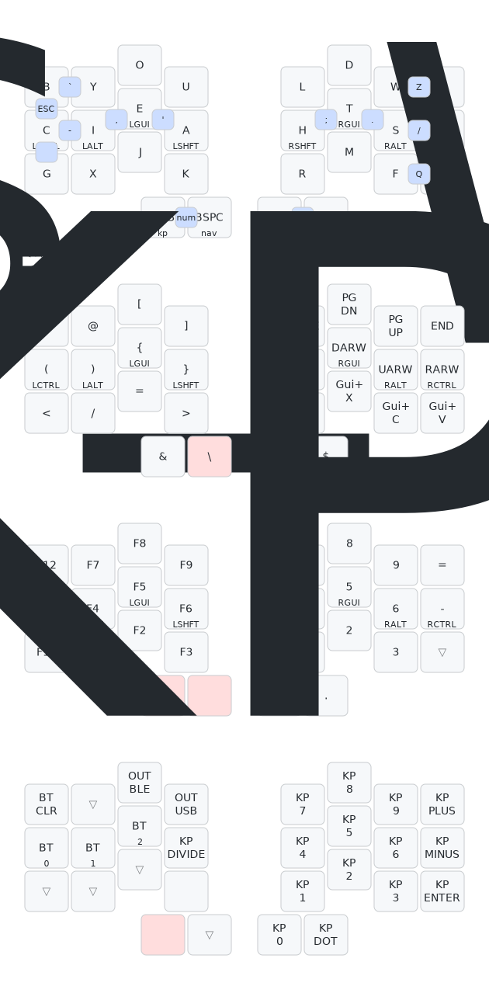

# 🍁 Sheesh

> _Sheesh_ is a tiny board to celebrate the coming of 🍂 with minimal finger
> travel.

After spending the day at my computer, I stepped out with friends Saturday night
for a burger & beverage. On the patio of our local institution, the air was
cool.

> _Autumn had undeniably arrived._

I had been wanting to squeeze a Ferris Sweep out of a Xiao somehow and it
occurred to me as I later continued working that maybe I was actually trying to
make a 28 key keyboard. When I started searching for a board outline, I reached for a 
leaf to lay over the keys. I choose a maple leaf both for the aesthetic quality with
which the keys fit, and for the pleasant memories of eating maple butter in
Montreal's Jean-Talon Market it conjured.

> [!NOTE]
> The name _sheesh_ honors the Ojibway people, who (according to the interwebs)
> call maple _sheesheegummavvis_: “sap flows fast."

The size of the Xiao makes it so attractive for smaller keyboards. _Sheesh_
repurposes the reset and nfc pins to squeeze enough I/O to directly connect the
28 keys. The cost of the pogo pins starts to add up, though. Using generic smd
ones from LCSC helps, but it's also a little ironic that the total length of the
battery and the Xiao is about the same as just using a proµ form factor, which
is more than an order of magnitude cheaper.

> [!IMPORTANT]
> If you have time, please drop a note to your local Seeed representative asking
> that they via the PDM pins (pins 0.16, 1.0, and 1.10) to pads on the underside
> of Xiao nFR52840. [Seeed USA](mailto:seeed_us@seeed.cc)
> [Seeed Europe](mailto:seeed_emea@seeed.cc)

## BOM

|      QTY      |            Part            | JLCPCB Part # |
| :-----------: | :------------------------: | :-----------: |
|       2       |     BAT-SMD_MY-LR44-02     |   C2902345    |
|       2       |         SSSS811101          |    C109335    |
|       4       |     MF254V-11-07-0743      |   C2889988    |
|       8       |       YZ00615050R-04       |   C5157400    |
| 56 (optional) |  3305-0-15-80-47-27-10-0   |   C17370797   |
|      28       | ChocV1 switches (Red Pros) |      N/A      |
|       2       |  3.7V LIR1254 (NOT LR44!)  |      N/A      |

## Putting it Together

#### Fabrication & Assembly Files[[zip](https://github.com/willpuckett/Sheesh/releases/latest/download/jlcpcb.zip)] 

For the love of god and country, please have this fabricated with red mask and
white silk.

> [!CAUTION]
> Use 3.7v LIR1254 (lithium ion rechargable) battery **only**.

## Case

There's a case
[[step](https://github.com/willpuckett/Sheesh/releases/latest/download/case.step)]
[[stl](https://github.com/willpuckett/Sheesh/releases/latest/download/case.step)]
that's really more of a skin. Print and place the pcb directly in it.

> [!TIP]
> Polymaker TPU works well. It seems to like to print slow and cool—leave the
> door open. Red or white would be ideal... The case is only one half, flip it
> in your slicer for the other half 🙃

TPU is relatively non-slip, and it absorbs and distributes the force of typing
very nicely, so no bumpons needed which further reduces height.

## Layouts

Download the latest ZMK Builds.

|  Layout   |                                                                                                  |                                                                                                    |
| :-------: | :----------------------------------------------------------------------------------------------: | :------------------------------------------------------------------------------------------------: |
|  qwerty   |  [left](https://github.com/willpuckett/Sheesh/releases/latest/download/sheesh_qwerty_left.uf2)   |  [right](https://github.com/willpuckett/Sheesh/releases/latest/download/sheesh_qwerty_right.uf2)   |
|  engram   |  [left](https://github.com/willpuckett/Sheesh/releases/latest/download/sheesh_engram_left.uf2)   |  [right](https://github.com/willpuckett/Sheesh/releases/latest/download/sheesh_engram_right.uf2)   |
| engrammer | [left](https://github.com/willpuckett/Sheesh/releases/latest/download/sheesh_engrammer_left.uf2) | [right](https://github.com/willpuckett/Sheesh/releases/latest/download/sheesh_engrammer_right.uf2) |

The link contains the following layouts...

### QWERTY

### Engram

### Engrammer

